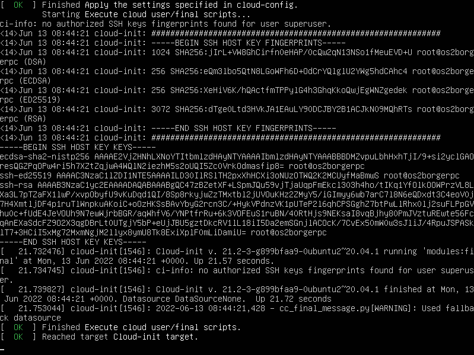

How to install and run OS2borgerPC Kiosk
****************************************

Install OS2borgerPC server image
--------------------------------

Get the most recent OS2borgerPC server image as provided by Magenta,
or build one yourself according to the instructions in the ``image``
directory.

Copy the image to a USB or DVD and boot the target computer with it.

The image will work with UEFI boot, but legacy boot is also supported.

The installation procedure will not ask a lot of questions. First of
all, it will ask you to choose a language for the installation, as shown
below:

.. image:: install_1.png

Unfortunately, Danish is currently not supported. Hit ENTER to keep
"English".

Next, specify the disk you will install on, as shown below:

If you're installing on a normal setup with only one hard disk attached,
the defaults will be fine - in that case, hit TAB until you reach "Done"
and hit ENTER. Otherwise, specify disk and partitions according to your
needs. 

As this will destroy all data in the disk in question, you will now be
asked to "Confirm destructive action". To proceed, select "Continue".

.. warning::  This step *will* destroy all data on the disk you install on.

The system will now install - this will take some time.

Remove the install media and reboot.

The login screen may contain output related to the upstart process:

.. image:: install_3.png

This is not a problem and you'll be able to login as the user ``superuser`` with password ``superuser``.

.. danger:: 
    Please change this password *immediately* after deploying each
    server!! There's a script in OS2borgerPC Admin to do this.

Getting network
---------------

If you installed with an Ethernet cable and a DHCP-enabled network, the
computer is already online. If you need to set up wireless network or
configure a static IP, you must first install basic wireless
capabilities - these are not installed by default. You don't need a
network connection, just enter the command::

    sudo wifi_setup

.. note:: If you don't need to use a wireless connection or do any
    other special network setup like setting up a static IP address,
    there is no need to execute this command.

With this in place, enter the following command::

    nmtui

To connect to a new network choose "Activate a connection" in the menu.
If everything works as it should and the computer has a wireless card,
you will see a list of wireless networks (if any exist, of course).

If you're already connected, e.g. through Ethernet, choose "Edit a
Connection". You can now setup static IP, etc.

.. note:: 

    In some cases, the wireless cards will not work properly unless the
    computer is connected through Ethernet during installation. We
    recommend that you install with an Internet-enabled Ethernet connection,
    though in some cases it will also work without it - it depends on
    your specific wireless card.

Connect to OS2borgerPC admin
----------------------------

Once you're connected to the network, enter the command::

    sudo os2borgerpc_kiosk_setup

This will install all dependencies for the OS2borgerPC client and
connect to the admin system.

.. note::

    This may take some time.

Setting up for Kiosk
--------------------

Once the computer is connected to the admin system and activated, you
may set it up to run as a kiosk.

In the admin system, we have introduced three global scripts with the
prefix "OS2borgerPC Kiosk".

The first is called "OS2borgerPC Kiosk  - Installer Chromium" and will
install the browser and setup minimum GUI capabilities. 

When this script has run successfully, you can configure Chromium to
start automatically on boot and configure the start URL and time delay
as needed. You do this by running the script called "OS2borgerPC Kiosk - Autostart
Chromium".

In this script, you must specify the following four parameters:

* ``time`` - a delay time before Chromium is started.
* ``url`` - the start URL for your kiosk, e.g. an OS2display site.
* ``width`` - the width (X) component of the desired screen resolution, e.g.
  "1980".
* ``height`` - the height component of the desired screen resolution, e.g.
  "1080".
* ``orientation`` - the orientation or rotation of the screen. Values
  must be one of ``normal``, ``right`` or ``left``. If this parameter is
  misspelled, the system will default to "normal".

The width and height parameters must correspond to the preferred
(maximum) screen resolution of your monitor.

In order to have remote access to this system, you need to run the
script called "OS2borgerPC Kiosk  - Installer SSH og VNC". After this, you'll
be able to SSH to the machine and to see its display by connecting with
a VNC client.

.. danger::

    You *must* change the standard password before or *immediately*
    after running this script.

.. note::

    You use ``superuser``'s standard UNIX password to SSH. In order to
    connect with VNC, you need to supply a specific VNC password as a
    parameter for this script.

Upgrade OS2displayPC from Ubuntu 16.04 to 20.04
-----------------------------------------------

This process consists, for each computer, of the following steps:

1. Run these scripts in any order on the target computer.
   You don't have to wait for one to finish before you run the next one:

   * **OS2borgerPC - Hook support**
   * | **OS2borgerPC hook - Beskyt konfiguration**
     | Use the parameter "ja".
   * | **OS2borgerPC hook - Etablér netforbindelse før tjek-ind**
     | Use the parameter "ja".

2. Run the script **OS2DisplayPC opdater til Ubuntu 20.04 (1)** on the target
computer. This will reboot the computer and leave the job in state
*Afsendt*.

3. Now run the script **OS2DisplayPC opdater til Ubuntu 20.04 (2)** on the
target computer. This will take some time - do not send further commands
until the job has succeeded and is seen to be in state *Udført*.

4. Reboot the computer by running the script **System - Genstart
computeren**.

5. Run the script **OS2DisplayPC opdater til Ubuntu 20.04 (3)**. Once
again, this will take some time, and you should wait until the job has
succeeded and is seen to be in state *Udført*.

6. Reboot the computer as in 4).

7. Run the script **OS2DisplayPC opdater til Ubuntu 20.04 (4)**. This
will *not* take a long time, the OS upgrade is done by now.

8. Reboot the computer as in 4) and 6) - after restart, the upgrade to Ubuntu
20.04 is complete.