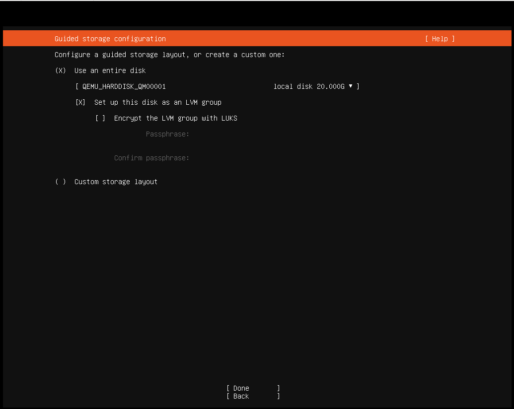

How to install and run OS2borgerPC Kiosk
****************************************

Install OS2borgerPC Kiosk image
-------------------------------

Get the most recent OS2borgerPC Kiosk image as provided by Magenta,
or build one yourself according to the instructions in the ``image``
directory.

Copy the image to a USB or DVD and boot the target computer with it.
Two cross platform programs for this purpose are "Balena Etcher" and "Rufus".

The image will work with UEFI boot, but legacy boot is also supported.

The installation procedure will not ask a lot of questions. First of
all, it will ask you to specify the disk you will install on, as shown below:

If you're installing on a normal setup with only one hard disk attached,
the defaults will be fine - in that case, hit TAB until you reach "Done"
and hit ENTER. Otherwise, specify disk and partitions according to your
needs.

As this will destroy all data in the disk in question, you will now be
asked to "Confirm destructive action". To proceed, select "Continue".

.. warning::  This step *will* destroy all data on the disk you install on.

The system will now install - this will take some time.

Remove the install media and reboot.

The login screen may contain output related to the upstart process:

.. image:: install_2.png

This is not a problem and you'll be able to login as the user ``superuser`` with password ``superuser``.

.. danger::
    Please change this password *immediately* after deploying each
    server!! There's a script in OS2borgerPC Admin to do this.

Getting internet access
-----------------------

If you installed with an Ethernet cable and a DHCP-enabled network, the
computer is already online. If you need to set up wireless network or
configure a static IP, you must first install basic wireless
capabilities - these are not installed by default. You don't need a
network connection, just enter the command::

    sudo wifi_setup

.. note:: If you don't need to use a wireless connection or do any
    other special network setup like setting up a static IP address,
    there is no need to execute this command.

.. note:: If what you want to connect to is a hidden SSID, see the guide below.

With this in place, enter the following command::

    nmtui

You navigate within ``nmtui`` via the arrow keys, Enter and Escape.

To connect to a new network choose "Activate a connection" in the menu.
If everything works as it should and the computer has a wireless card,
you will see a list of wireless networks (if any exist, of course).

Once you've found and selected the desired Wi-Fi from the list, you
will be prompted for its password.

If you need to connect to a WPA2 Enterprise network, it may not work
from ``nmtui``. In this case we suggest, if possible, that the machine
is installed over another Wi-Fi or a LAN, and subsequently moved
to the WPA2 Enterprise Wi-Fi. We have a script in the admin system for
this purpose.

If you're already connected, e.g. through Ethernet, choose "Edit a
Connection". You can now setup static IP, etc.

.. note::
    In some cases, the wireless cards will not work properly unless the
    computer is connected through Ethernet during installation. We
    recommend that you install with an Internet-enabled Ethernet connection,
    though in some cases it will also work without it - it depends on
    your specific wireless card.

Connect to OS2borgerPC-admin (our admin system)
-----------------------------------------------

Once you're connected to the network, enter the command::

    sudo os2borgerpc_kiosk_setup

This will install all dependencies for the OS2borgerPC client.

.. note::

    This may take some time.

Finally you'll be prompted for information to register the machine
with our admin system:

- ``name``: Give the computer any valid name you like.
- ``site``: If hosted by us: Use the site name we should've e-mailed you. If self-hosting or developing: Create a site, and
  specify its name here.
- ``server``: If hosted by us: Just press enter. If self-hosting specify the domain of your server. For development its
  likely some port on localhost.

Setting up a browser
--------------------

Once the computer is connected to the admin system and activated, you
may set it up to run a browser in kiosk mode.

There are two scripts needed to do this.

The first is called "OS2borgerPC Kiosk  - Installer Chromium" and will
install the browser and setup minimum GUI capabilities.

When this script has run successfully, you can configure Chromium to
start automatically on boot and configure the start URL and time delay
as needed. You do this by running the script called "OS2borgerPC Kiosk - Autostart
Chromium".

In this script, you must specify the following four parameters:

* ``time`` - a delay time before Chromium is started.
* ``url`` - the start URL for your kiosk, e.g. an OS2display site.
* ``width`` - the width (X) component of the desired screen resolution, e.g.
  "1980".
* ``height`` - the height component of the desired screen resolution, e.g.
  "1080".
* ``orientation`` - the orientation or rotation of the screen. Values
  must be one of ``normal``, ``right`` or ``left``. If this parameter is
  misspelled, the system will default to "normal".

The width and height parameters must correspond to the preferred
(maximum) screen resolution of your monitor.

Advanced topics (not relevant for most setups)
----------------------------------------------

Connect to a hidden SSID
========================

When it's a hidden SSID ``nmtui`` currently cannot see it, and thus can't activate  a connection to it.

Here follows a workaround:

Type ``nmtui`` in the terminal and press Enter to start it.

You navigate within ``nmtui`` via the arrow keys, Enter and Escape.

Select "Rediger en forbindelse" ("Edit a connection") and press Enter.

On this page you may see a list of Wi-Fi SSIDs on the left, that the computer is able to see. Ignore them.

Select "Tilføj" ("Add") and press Enter.

Select "Wi-Fi", then "Opret" ("Create") and press Enter.

Here you fill out the information about the Wi-Fi.

You need to fill out "Profilnavn" ("Profile name"). This is the *connection name*.

.. note::
    Remember this profile/connection name for later in the guide.

While technically the exact value of this is unimportant, we suggest making it the
name of the hidden SSID.

You also need to fill out "SSID".

You also need to select which type of "Sikkerhed" ("Security") it's using, such as WPA2 Personal, and the password.

You **don't** need to fill out "Enhed" ("Device") unless you have multiple Wireless Ethernet Cards and you want to specify
which of them should connect.

Once all the relevant details have been entered, select "OK" and press Enter.

Select "Tilbage" ("Back") and press Enter.

Select "Afslut" ("Quit") and press Enter.

In this step, you'll need the *connection name* you decided on earlier.

Now type in the following command and afterwards press Enter::

    sudo nmcli con up NAME-OF-CONNECTION-HERE

.. note::
    If the name of the connection you chose has spaces in the name,
    you'll need to write "" around the name in the command above.

Now you should have internet access through the wireless with hidden SSID!

Additional remote access
========================

If you want additional remote access to this system, besides being able to run scripts
on it from the admin system, you can run the script called
"OS2borgerPC Kiosk  - Installer SSH og VNC". After this, you'll
be able to SSH to the machine and to see its display by connecting with
a VNC client.

.. danger::
    You *must* change the standard password before or *immediately*
    after running this script.

.. note::
    You use ``superuser``'s standard UNIX password to SSH. In order to
    connect with VNC, you need to supply a specific VNC password as a
    parameter for this script.
